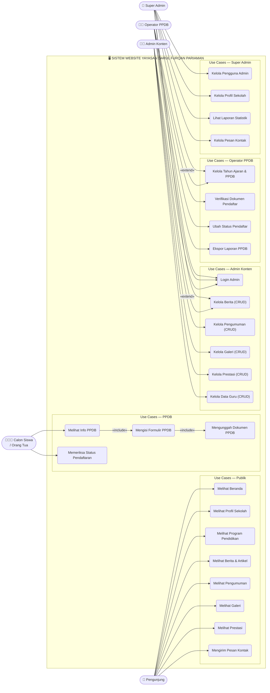
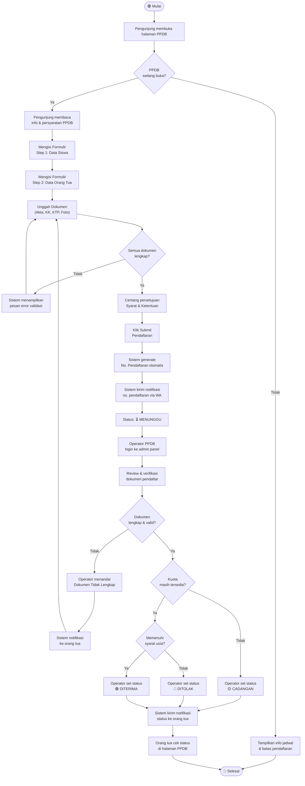
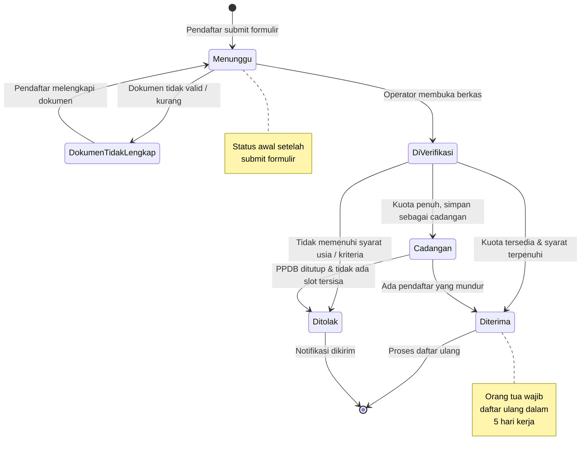
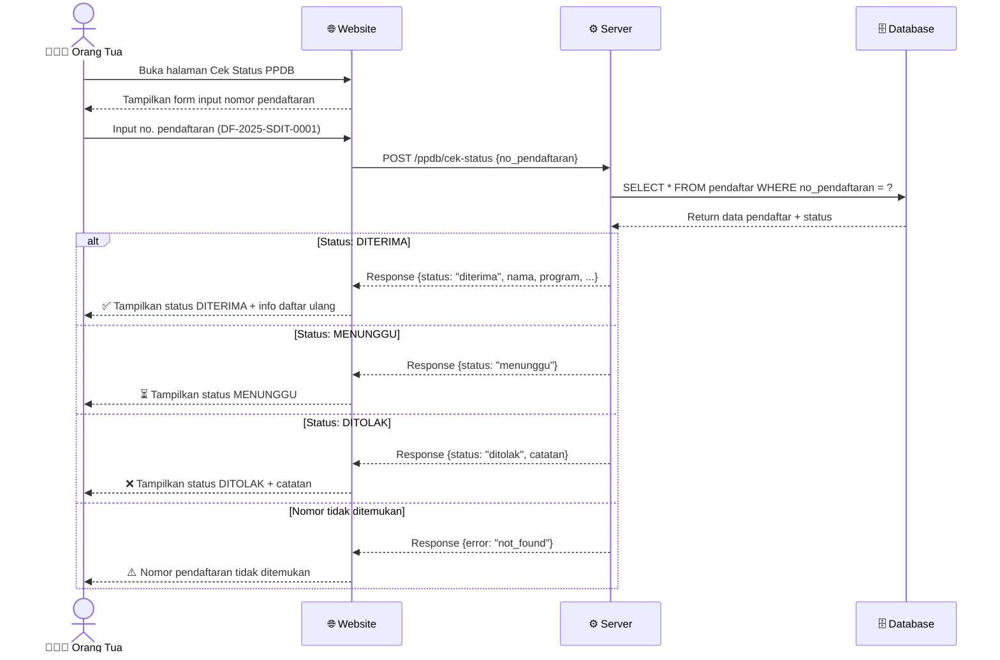
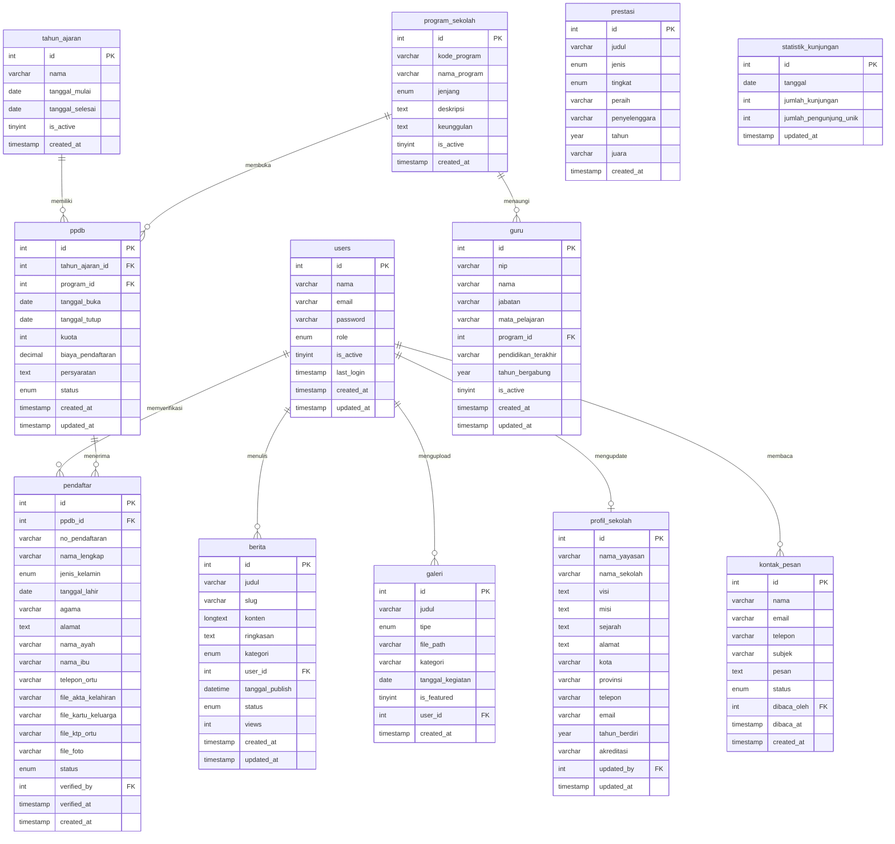

# Jawaban Tugas Kelompok ke-3

## Analisis dan Desain Sistem Informasi — Week 8

### Pengembangan Sistem Informasi Cerdas dengan Digitalisasi Profil Sekolah

### (Yayasan Darul Furqan Pariaman)

> **Referensi Utama:**
>
> - Satzinger, J.W., Jackson, R.B., Burd, S.D. (2016). _System Analysis and Design in a Changing World_. 7th Ed. Cengage Learning.
> - Dina Fitria Murad (2024). _Analysis, Design, and Development Information System_. PT. Widia Inovasi Nusantara.
> - Lecture Notes 1–8, BINUS ONLINE — Information Systems Analysis and Design.

---

## Nomor 1 — Fitur-fitur Aplikasi (LO2 | Skor: 15)

### Dasar Teori

Berdasarkan **LN 2 (Investigating System Requirements)**, sebelum mengembangkan sistem, analis harus mengumpulkan _requirements_ melalui aktivitas analisis: _Gather detailed information, Define requirements, Prioritize requirements, Develop user-interface dialogs, dan Evaluate requirements with users_. Requirements dibagi menjadi dua jenis (LN 2, Gambar 2.1):

- **Functional Requirements**: proses yang harus mampu diakomodir sistem, atau informasi yang harus dikelola.
- **Non-Functional Requirements** (FURPS): karakteristik yang harus dimiliki sistem — Functionality, Usability, Reliability, Performance, Supportability.

### Identifikasi Fitur

#### A. Fitur Front-End (Publik / Pengunjung)

| No  | Fitur                           | Deskripsi Fungsional                                                                           |
| --- | ------------------------------- | ---------------------------------------------------------------------------------------------- |
| 1   | **Beranda (Homepage)**          | Halaman utama dengan hero banner, statistik sekolah, program unggulan, berita terbaru, dan CTA |
| 2   | **Profil Sekolah**              | Visi, Misi, Sejarah Yayasan, Struktur Organisasi, Akreditasi, Lokasi                           |
| 3   | **Program Pendidikan**          | Deskripsi program PAUD, SDIT Alam, dan Pondok Pesantren                                        |
| 4   | **Data Guru & Tenaga Pendidik** | Profil singkat guru dan staf pengajar                                                          |
| 5   | **PPDB Online**                 | Formulir Penerimaan Peserta Didik Baru, unggah dokumen, cek status pendaftaran                 |
| 6   | **Berita & Artikel**            | Publikasi berita, kegiatan, dan artikel sekolah                                                |
| 7   | **Pengumuman**                  | Informasi penting, jadwal, kebijakan sekolah                                                   |
| 8   | **Galeri Foto & Video**         | Dokumentasi kegiatan dan fasilitas sekolah                                                     |
| 9   | **Prestasi**                    | Data prestasi siswa dan sekolah di berbagai tingkat kompetisi                                  |
| 10  | **Kontak & Lokasi**             | Formulir pesan, Google Maps embed, nomor telepon, email                                        |

#### B. Fitur Back-End (Admin / Operator)

| No  | Fitur                        | Deskripsi Fungsional                                                                 |
| --- | ---------------------------- | ------------------------------------------------------------------------------------ |
| 1   | **Dashboard Admin**          | Ringkasan statistik: jumlah pengunjung, pendaftar PPDB, pesan masuk                  |
| 2   | **Manajemen Konten Berita**  | CRUD berita dan artikel (Create, Read, Update, Delete)                               |
| 3   | **Manajemen Pengumuman**     | CRUD pengumuman sekolah                                                              |
| 4   | **Manajemen Galeri**         | Kelola foto dan video kegiatan sekolah                                               |
| 5   | **Manajemen PPDB**           | Buka/tutup pendaftaran, verifikasi dokumen, ubah status pendaftar (diterima/ditolak) |
| 6   | **Manajemen Data Guru**      | CRUD data guru dan tenaga pendidik                                                   |
| 7   | **Manajemen Prestasi**       | CRUD data prestasi siswa/sekolah                                                     |
| 8   | **Manajemen Profil Sekolah** | Update informasi dasar sekolah, visi, misi                                           |
| 9   | **Manajemen Pengguna Admin** | Kelola akun admin dan hak akses (role-based)                                         |
| 10  | **Laporan Statistik**        | Laporan data PPDB per tahun ajaran, log pengunjung                                   |

#### C. Non-Functional Requirements

| Kategori FURPS     | Kebutuhan                                                      |
| ------------------ | -------------------------------------------------------------- |
| **Functionality**  | Semua fitur berjalan sesuai spesifikasi bisnis                 |
| **Usability**      | Antarmuka mudah dipahami, responsif di semua perangkat         |
| **Reliability**    | Sistem tersedia 24/7, toleransi terhadap kesalahan             |
| **Performance**    | Halaman termuat dalam < 3 detik                                |
| **Supportability** | Mudah di-update, dokumentasi tersedia                          |
| **Security**       | Autentikasi admin, enkripsi data sensitif, proteksi CSRF & XSS |

---

## Nomor 2 — Use Case Diagram (LO3 | Skor: 15)

### Dasar Teori

Berdasarkan **LN 3 (Identifying User Stories and Use Cases)**, _Use Case_ menggambarkan suatu tugas yang dilakukan oleh satu orang di satu tempat sebagai respons terhadap suatu _business event_. Use Case Diagram mencakup seluruh _actor_ yang berinteraksi dengan sistem, baik dari sisi _front-end_ maupun _back-end_.

Teknik identifikasi menggunakan **User Goal Technique** (LN 3): mengidentifikasi semua use case dengan mencantumkan tujuan pengguna masing-masing aktor.

Validasi use case menggunakan **Teknik CRUD** (LN 5): memastikan setiap entitas data memiliki use case untuk Create, Read, Update, dan Delete.

### Identifikasi Actor

| Actor                       | Jenis     | Deskripsi                                          |
| --------------------------- | --------- | -------------------------------------------------- |
| **Pengunjung (Guest)**      | Front-end | Masyarakat umum yang mengakses website tanpa login |
| **Calon Siswa / Orang Tua** | Front-end | Pengguna yang melakukan pendaftaran PPDB           |
| **Super Admin**             | Back-end  | Pengelola tertinggi sistem, akses penuh            |
| **Admin Konten**            | Back-end  | Mengelola konten berita, galeri, pengumuman        |
| **Operator PPDB**           | Back-end  | Mengelola proses penerimaan peserta didik baru     |

### Use Case Diagram (Mermaid)



### Use Case Diagram — Versi Notasi Teks

```
+------------------------------------------------------------------+
|                    SISTEM WEBSITE SEKOLAH                        |
|                   YAYASAN DARUL FURQAN PARIAMAN                  |
|                                                                  |
|  PENGUNJUNG                                                      |
|  +-----------+                                                   |
|  |  (actor)  |--- Melihat Beranda                               |
|  |           |--- Melihat Profil Sekolah                        |
|  |           |--- Melihat Program Pendidikan                    |
|  | Pengunjung|--- Melihat Berita & Artikel                      |
|  |  (Guest)  |--- Melihat Pengumuman                            |
|  |           |--- Melihat Galeri                                |
|  |           |--- Melihat Prestasi                              |
|  |           |--- Mengirim Pesan Kontak                         |
|  +-----------+                                                   |
|                                                                  |
|  CALON SISWA / ORANG TUA                                         |
|  +-----------+                                                   |
|  |  (actor)  |--- Melihat Info PPDB        (include: Melihat    |
|  |  Calon    |--- Mengisi Formulir PPDB      Program PPDB)      |
|  |  Siswa /  |--- Mengunggah Dokumen PPDB                       |
|  | Orang Tua |--- Memeriksa Status Pendaftaran                  |
|  +-----------+                                                   |
|                                                                  |
|  ADMIN KONTEN                                                    |
|  +-----------+                                                   |
|  |  (actor)  |--- Login Admin                                   |
|  |   Admin   |--- Kelola Berita (CRUD)                          |
|  |  Konten   |--- Kelola Pengumuman (CRUD)                      |
|  |           |--- Kelola Galeri (CRUD)                          |
|  |           |--- Kelola Prestasi (CRUD)                        |
|  |           |--- Kelola Data Guru (CRUD)                       |
|  +-----------+                                                   |
|                                                                  |
|  OPERATOR PPDB                                                   |
|  +-----------+                                                   |
|  |  (actor)  |--- Login Admin                                   |
|  | Operator  |--- Kelola Tahun Ajaran & Program PPDB            |
|  |   PPDB    |--- Verifikasi Dokumen Pendaftar                  |
|  |           |--- Ubah Status Pendaftar (Diterima/Ditolak)      |
|  |           |--- Ekspor Data Pendaftar (Laporan)               |
|  +-----------+                                                   |
|                                                                  |
|  SUPER ADMIN                                                     |
|  +-----------+                                                   |
|  |  (actor)  |--- Login Admin          (extend: semua akses     |
|  |   Super   |--- Kelola Pengguna Admin  Admin Konten &         |
|  |   Admin   |--- Kelola Profil Sekolah  Operator PPDB)         |
|  |           |--- Lihat Laporan Statistik                       |
|  |           |--- Kelola Pesan Kontak                           |
|  |           |--- Backup & Restore Data                         |
|  +-----------+                                                   |
+------------------------------------------------------------------+
```

### Tabel Use Case Lengkap

| No    | Use Case                     | Actor         | Tipe    | Deskripsi                                            |
| ----- | ---------------------------- | ------------- | ------- | ---------------------------------------------------- |
| UC-01 | Melihat Beranda              | Pengunjung    | Primary | Menampilkan hero, statistik, program, berita terbaru |
| UC-02 | Melihat Profil Sekolah       | Pengunjung    | Primary | Visi, misi, sejarah, struktur organisasi             |
| UC-03 | Melihat Program Pendidikan   | Pengunjung    | Primary | PAUD, SDIT, Pondok Pesantren                         |
| UC-04 | Melihat Berita & Artikel     | Pengunjung    | Primary | Daftar dan detail berita sekolah                     |
| UC-05 | Melihat Pengumuman           | Pengunjung    | Primary | Pengumuman penting sekolah                           |
| UC-06 | Melihat Galeri               | Pengunjung    | Primary | Galeri foto dan video kegiatan                       |
| UC-07 | Melihat Prestasi             | Pengunjung    | Primary | Daftar prestasi siswa dan sekolah                    |
| UC-08 | Mengirim Pesan Kontak        | Pengunjung    | Primary | Form kontak ke pihak sekolah                         |
| UC-09 | Melihat Info PPDB            | Calon Siswa   | Primary | Syarat, jadwal, dan info pendaftaran                 |
| UC-10 | Mengisi Formulir PPDB        | Calon Siswa   | Primary | Isi data diri pendaftaran (include UC-11)            |
| UC-11 | Mengunggah Dokumen PPDB      | Calon Siswa   | Include | Upload KTP orang tua, akta lahir, KK, foto           |
| UC-12 | Memeriksa Status Pendaftaran | Calon Siswa   | Primary | Cek status menggunakan nomor pendaftaran             |
| UC-13 | Login Admin                  | Semua Admin   | Primary | Autentikasi pengguna backend                         |
| UC-14 | Kelola Berita (CRUD)         | Admin Konten  | Primary | Tambah, lihat, edit, hapus berita                    |
| UC-15 | Kelola Pengumuman (CRUD)     | Admin Konten  | Primary | Tambah, lihat, edit, hapus pengumuman                |
| UC-16 | Kelola Galeri (CRUD)         | Admin Konten  | Primary | Tambah, lihat, edit, hapus galeri                    |
| UC-17 | Kelola Prestasi (CRUD)       | Admin Konten  | Primary | Tambah, lihat, edit, hapus prestasi                  |
| UC-18 | Kelola Data Guru (CRUD)      | Admin Konten  | Primary | Tambah, lihat, edit, hapus data guru                 |
| UC-19 | Kelola Tahun Ajaran & PPDB   | Operator PPDB | Primary | Buka/tutup PPDB, atur kuota                          |
| UC-20 | Verifikasi Dokumen Pendaftar | Operator PPDB | Primary | Review dan verifikasi berkas                         |
| UC-21 | Ubah Status Pendaftar        | Operator PPDB | Primary | Terima/tolak pendaftar                               |
| UC-22 | Ekspor Laporan PPDB          | Operator PPDB | Primary | Download data pendaftar                              |
| UC-23 | Kelola Pengguna Admin        | Super Admin   | Primary | CRUD akun admin dan role                             |
| UC-24 | Kelola Profil Sekolah        | Super Admin   | Primary | Update info dasar sekolah                            |
| UC-25 | Lihat Laporan Statistik      | Super Admin   | Primary | Dashboard statistik sistem                           |
| UC-26 | Kelola Pesan Kontak          | Super Admin   | Primary | Baca dan tanggapi pesan kontak                       |

---

### Activity Diagram — Proses PPDB Online (Mermaid)

> Berdasarkan **LN 3** dan **LN 5**: Activity Diagram digunakan untuk memodelkan alur kerja use case secara detail, menggambarkan langkah-langkah yang dilakukan oleh actor dan sistem.



---

### State Machine Diagram — Status Pendaftar (Mermaid)

> Berdasarkan **LN 4 (State Machine Diagram)**: State Machine Diagram menggambarkan kondisi-kondisi yang mungkin dimiliki oleh suatu objek dan transisi antar state tersebut sebagai respons terhadap suatu event.



---

### Sequence Diagram — Alur Cek Status Pendaftaran (Mermaid)

> Berdasarkan **LN 5 (System Sequence Diagram)**: SSD menggambarkan interaksi antara actor dan sistem dalam bentuk urutan pesan yang dikirim dan diterima.



---

## Nomor 3 — Desain Database Lengkap (LO3 | Skor: 20)

### Dasar Teori

Berdasarkan **LN 7 (Designing the Database)**, database adalah kumpulan integrasi dari data tersimpan yang terpusat, dikelola dan dikendalikan oleh DBMS. Desain database relasional menggunakan konsep dari **LN 4 (Domain Modelling)** yaitu entitas, atribut, dan asosiasi antar entitas yang dimodelkan melalui ERD (Entity-Relationship Diagram). DBMS yang direkomendasikan: **MySQL**.

Teknik identifikasi entitas menggunakan **Noun Technique** (LN 4): mengidentifikasi semua kata benda dalam deskripsi kebutuhan sistem yang menjadi kandidat entitas data.

### Entity Relationship Diagram (Mermaid — ERD)



### Entity Relationship Diagram (Deskripsi Teks)

```
users (1) --------< berita (M)         [users.id = berita.user_id]
users (1) --------< galeri (M)         [users.id = galeri.user_id]
users (1) --------< pendaftar (M)      [users.id = pendaftar.verified_by]
users (1) --------< kontak_pesan (M)   [users.id = kontak_pesan.dibaca_oleh]
users (1) --------o profil_sekolah (1) [users.id = profil_sekolah.updated_by]
ppdb (1) ---------< pendaftar (M)      [ppdb.id = pendaftar.ppdb_id]
program_sekolah(1)< ppdb (M)           [program_sekolah.id = ppdb.program_id]
program_sekolah(1)< guru (M)           [program_sekolah.id = guru.program_id]
tahun_ajaran(1) --< ppdb (M)           [tahun_ajaran.id = ppdb.tahun_ajaran_id]
```

### Daftar Tabel & Atribut

**1. Tabel `users`** — Data pengguna admin sistem

| Kolom      | Tipe                                               | Keterangan             |
| ---------- | -------------------------------------------------- | ---------------------- |
| id         | INT PK AUTO_INCREMENT                              | Primary Key            |
| nama       | VARCHAR(100)                                       | Nama lengkap admin     |
| email      | VARCHAR(100) UNIQUE                                | Email login            |
| password   | VARCHAR(255)                                       | Password (bcrypt hash) |
| role       | ENUM('super_admin','admin_konten','operator_ppdb') | Hak akses              |
| is_active  | TINYINT(1) DEFAULT 1                               | Status aktif akun      |
| last_login | TIMESTAMP NULL                                     | Waktu login terakhir   |
| created_at | TIMESTAMP                                          | Waktu dibuat           |
| updated_at | TIMESTAMP                                          | Waktu diperbarui       |

**2. Tabel `profil_sekolah`** — Informasi dasar sekolah

| Kolom         | Tipe                  | Keterangan                           |
| ------------- | --------------------- | ------------------------------------ |
| id            | INT PK AUTO_INCREMENT | Primary Key                          |
| nama_yayasan  | VARCHAR(200)          | Nama yayasan                         |
| nama_sekolah  | VARCHAR(200)          | Nama sekolah                         |
| visi          | TEXT                  | Visi sekolah                         |
| misi          | TEXT                  | Misi sekolah (JSON array / paragraf) |
| sejarah       | TEXT                  | Sejarah pendirian                    |
| alamat        | TEXT                  | Alamat lengkap                       |
| kota          | VARCHAR(100)          | Kota                                 |
| provinsi      | VARCHAR(100)          | Provinsi                             |
| kode_pos      | VARCHAR(10)           | Kode pos                             |
| telepon       | VARCHAR(20)           | Nomor telepon                        |
| email         | VARCHAR(100)          | Email resmi sekolah                  |
| website       | VARCHAR(200)          | URL website                          |
| logo          | VARCHAR(255)          | Path file logo                       |
| maps_embed    | TEXT                  | URL embed Google Maps                |
| tahun_berdiri | YEAR                  | Tahun pendirian                      |
| akreditasi    | VARCHAR(5)            | Nilai akreditasi (A/B/C)             |
| updated_at    | TIMESTAMP             | Waktu diperbarui                     |
| updated_by    | INT FK → users.id     | Admin yang mengupdate                |

**3. Tabel `program_sekolah`** — Program pendidikan yang tersedia

| Kolom        | Tipe                                      | Keterangan                     |
| ------------ | ----------------------------------------- | ------------------------------ |
| id           | INT PK AUTO_INCREMENT                     | Primary Key                    |
| kode_program | VARCHAR(20) UNIQUE                        | Kode unik (PAUD, SDIT, PONPES) |
| nama_program | VARCHAR(100)                              | Nama program                   |
| jenjang      | ENUM('PAUD','SD','SMP','SMA','Pesantren') | Jenjang pendidikan             |
| deskripsi    | TEXT                                      | Deskripsi program              |
| keunggulan   | TEXT                                      | Keunggulan program             |
| gambar       | VARCHAR(255)                              | Path gambar program            |
| is_active    | TINYINT(1) DEFAULT 1                      | Status program aktif           |
| created_at   | TIMESTAMP                                 | Waktu dibuat                   |

**4. Tabel `tahun_ajaran`** — Data tahun ajaran

| Kolom           | Tipe                  | Keterangan                |
| --------------- | --------------------- | ------------------------- |
| id              | INT PK AUTO_INCREMENT | Primary Key               |
| nama            | VARCHAR(20) UNIQUE    | Contoh: 2024/2025         |
| tanggal_mulai   | DATE                  | Awal tahun ajaran         |
| tanggal_selesai | DATE                  | Akhir tahun ajaran        |
| is_active       | TINYINT(1) DEFAULT 0  | Status tahun ajaran aktif |
| created_at      | TIMESTAMP             | Waktu dibuat              |

**5. Tabel `ppdb`** — Konfigurasi penerimaan peserta didik baru

| Kolom             | Tipe                                                     | Keterangan                |
| ----------------- | -------------------------------------------------------- | ------------------------- |
| id                | INT PK AUTO_INCREMENT                                    | Primary Key               |
| tahun_ajaran_id   | INT FK → tahun_ajaran.id                                 | Tahun ajaran PPDB         |
| program_id        | INT FK → program_sekolah.id                              | Program yang membuka PPDB |
| tanggal_buka      | DATE                                                     | Tanggal buka pendaftaran  |
| tanggal_tutup     | DATE                                                     | Tanggal tutup pendaftaran |
| kuota             | INT                                                      | Kuota siswa baru          |
| biaya_pendaftaran | DECIMAL(10,2) DEFAULT 0                                  | Biaya daftar (jika ada)   |
| persyaratan       | TEXT                                                     | Daftar persyaratan        |
| catatan           | TEXT NULL                                                | Catatan tambahan          |
| status            | ENUM('akan_datang','buka','tutup') DEFAULT 'akan_datang' | Status PPDB               |
| created_at        | TIMESTAMP                                                | Waktu dibuat              |
| updated_at        | TIMESTAMP                                                | Waktu diperbarui          |

**6. Tabel `pendaftar`** — Data calon siswa yang mendaftar

| Kolom               | Tipe                                                                | Keterangan                         |
| ------------------- | ------------------------------------------------------------------- | ---------------------------------- |
| id                  | INT PK AUTO_INCREMENT                                               | Primary Key                        |
| ppdb_id             | INT FK → ppdb.id                                                    | PPDB yang diikuti                  |
| no_pendaftaran      | VARCHAR(30) UNIQUE                                                  | Nomor pendaftaran (auto-generated) |
| nama_lengkap        | VARCHAR(150)                                                        | Nama lengkap calon siswa           |
| jenis_kelamin       | ENUM('L','P')                                                       | Jenis kelamin                      |
| tempat_lahir        | VARCHAR(100)                                                        | Tempat lahir                       |
| tanggal_lahir       | DATE                                                                | Tanggal lahir                      |
| agama               | VARCHAR(30)                                                         | Agama                              |
| anak_ke             | INT                                                                 | Anak ke-                           |
| alamat              | TEXT                                                                | Alamat lengkap                     |
| asal_sekolah        | VARCHAR(150) NULL                                                   | Nama sekolah asal (jika ada)       |
| nama_ayah           | VARCHAR(150)                                                        | Nama ayah                          |
| nama_ibu            | VARCHAR(150)                                                        | Nama ibu                           |
| pekerjaan_ayah      | VARCHAR(100)                                                        | Pekerjaan ayah                     |
| pekerjaan_ibu       | VARCHAR(100)                                                        | Pekerjaan ibu                      |
| pendidikan_ayah     | VARCHAR(50)                                                         | Pendidikan terakhir ayah           |
| pendidikan_ibu      | VARCHAR(50)                                                         | Pendidikan terakhir ibu            |
| telepon_ortu        | VARCHAR(20)                                                         | Nomor telepon orang tua            |
| email_ortu          | VARCHAR(100) NULL                                                   | Email orang tua                    |
| file_akta_kelahiran | VARCHAR(255) NULL                                                   | Path file akta kelahiran           |
| file_kartu_keluarga | VARCHAR(255) NULL                                                   | Path file KK                       |
| file_ktp_ortu       | VARCHAR(255) NULL                                                   | Path file KTP orang tua            |
| file_foto           | VARCHAR(255) NULL                                                   | Path foto calon siswa              |
| status              | ENUM('menunggu','diterima','ditolak','cadangan') DEFAULT 'menunggu' | Status pendaftaran                 |
| catatan_operator    | TEXT NULL                                                           | Catatan dari operator              |
| verified_by         | INT NULL FK → users.id                                              | Admin yang memverifikasi           |
| verified_at         | TIMESTAMP NULL                                                      | Waktu verifikasi                   |
| created_at          | TIMESTAMP                                                           | Waktu submit pendaftaran           |

**7. Tabel `berita`** — Artikel berita dan informasi sekolah

| Kolom           | Tipe                                                 | Keterangan            |
| --------------- | ---------------------------------------------------- | --------------------- |
| id              | INT PK AUTO_INCREMENT                                | Primary Key           |
| judul           | VARCHAR(255)                                         | Judul berita          |
| slug            | VARCHAR(255) UNIQUE                                  | URL-friendly title    |
| konten          | LONGTEXT                                             | Isi berita (HTML)     |
| ringkasan       | TEXT NULL                                            | Ringkasan singkat     |
| gambar_utama    | VARCHAR(255) NULL                                    | Path gambar thumbnail |
| kategori        | ENUM('berita','artikel','kegiatan','pengumuman')     | Kategori konten       |
| tags            | VARCHAR(255) NULL                                    | Tag/label (CSV)       |
| user_id         | INT FK → users.id                                    | Penulis (admin)       |
| tanggal_publish | DATETIME                                             | Waktu publikasi       |
| status          | ENUM('draft','published','archived') DEFAULT 'draft' | Status publikasi      |
| views           | INT DEFAULT 0                                        | Jumlah kali dibaca    |
| created_at      | TIMESTAMP                                            | Waktu dibuat          |
| updated_at      | TIMESTAMP                                            | Waktu diperbarui      |

**8. Tabel `galeri`** — Galeri foto dan video

| Kolom            | Tipe                                | Keterangan                   |
| ---------------- | ----------------------------------- | ---------------------------- |
| id               | INT PK AUTO_INCREMENT               | Primary Key                  |
| judul            | VARCHAR(200)                        | Judul foto/video             |
| deskripsi        | TEXT NULL                           | Deskripsi                    |
| tipe             | ENUM('foto','video') DEFAULT 'foto' | Tipe media                   |
| file_path        | VARCHAR(255)                        | Path file / URL video        |
| thumbnail        | VARCHAR(255) NULL                   | Path thumbnail               |
| kategori         | VARCHAR(100)                        | Kategori kegiatan            |
| tanggal_kegiatan | DATE NULL                           | Tanggal kegiatan berlangsung |
| is_featured      | TINYINT(1) DEFAULT 0                | Tampilkan di beranda         |
| user_id          | INT FK → users.id                   | Admin yang mengupload        |
| created_at       | TIMESTAMP                           | Waktu dibuat                 |

**9. Tabel `guru`** — Data guru dan tenaga pendidik

| Kolom               | Tipe                        | Keterangan                 |
| ------------------- | --------------------------- | -------------------------- |
| id                  | INT PK AUTO_INCREMENT       | Primary Key                |
| nip                 | VARCHAR(30) NULL UNIQUE     | Nomor Induk Pegawai        |
| nama                | VARCHAR(150)                | Nama lengkap               |
| jabatan             | VARCHAR(100)                | Jabatan/posisi             |
| mata_pelajaran      | VARCHAR(200) NULL           | Mata pelajaran yang diampu |
| program_id          | INT FK → program_sekolah.id | Program tempat bertugas    |
| pendidikan_terakhir | VARCHAR(100)                | Pendidikan terakhir        |
| universitas         | VARCHAR(200) NULL           | Asal perguruan tinggi      |
| tahun_bergabung     | YEAR                        | Tahun mulai mengajar       |
| bio                 | TEXT NULL                   | Biografi singkat           |
| gambar              | VARCHAR(255) NULL           | Foto profil                |
| is_active           | TINYINT(1) DEFAULT 1        | Status aktif               |
| created_at          | TIMESTAMP                   | Waktu dibuat               |
| updated_at          | TIMESTAMP                   | Waktu diperbarui           |

**10. Tabel `prestasi`** — Prestasi siswa dan sekolah

| Kolom         | Tipe                                                           | Keterangan                          |
| ------------- | -------------------------------------------------------------- | ----------------------------------- |
| id            | INT PK AUTO_INCREMENT                                          | Primary Key                         |
| judul         | VARCHAR(255)                                                   | Judul prestasi                      |
| deskripsi     | TEXT NULL                                                      | Deskripsi detail                    |
| jenis         | ENUM('akademik','non_akademik','lembaga')                      | Jenis prestasi                      |
| tingkat       | ENUM('kecamatan','kota','provinsi','nasional','internasional') | Tingkat kompetisi                   |
| peraih        | VARCHAR(200) NULL                                              | Nama siswa peraih (jika individual) |
| penyelenggara | VARCHAR(200)                                                   | Penyelenggara kompetisi             |
| tahun         | YEAR                                                           | Tahun perolehan                     |
| juara         | VARCHAR(50) NULL                                               | Posisi juara (Juara 1, 2, dst)      |
| gambar        | VARCHAR(255) NULL                                              | Path foto piagam/trophy             |
| created_at    | TIMESTAMP                                                      | Waktu dibuat                        |

**11. Tabel `kontak_pesan`** — Pesan dari pengunjung

| Kolom           | Tipe                                                                 | Keterangan            |
| --------------- | -------------------------------------------------------------------- | --------------------- |
| id              | INT PK AUTO_INCREMENT                                                | Primary Key           |
| nama            | VARCHAR(100)                                                         | Nama pengirim         |
| email           | VARCHAR(100)                                                         | Email pengirim        |
| telepon         | VARCHAR(20) NULL                                                     | Nomor telepon         |
| subjek          | VARCHAR(200)                                                         | Subjek pesan          |
| pesan           | TEXT                                                                 | Isi pesan             |
| status          | ENUM('belum_dibaca','sudah_dibaca','dibalas') DEFAULT 'belum_dibaca' | Status pesan          |
| catatan_balasan | TEXT NULL                                                            | Catatan balasan admin |
| dibaca_oleh     | INT NULL FK → users.id                                               | Admin yang membaca    |
| dibaca_at       | TIMESTAMP NULL                                                       | Waktu dibaca          |
| created_at      | TIMESTAMP                                                            | Waktu pesan dikirim   |

**12. Tabel `statistik_kunjungan`** — Log kunjungan harian

| Kolom                  | Tipe                  | Keterangan                         |
| ---------------------- | --------------------- | ---------------------------------- |
| id                     | INT PK AUTO_INCREMENT | Primary Key                        |
| tanggal                | DATE UNIQUE           | Tanggal kunjungan                  |
| jumlah_kunjungan       | INT DEFAULT 0         | Total kunjungan pada hari tersebut |
| jumlah_pengunjung_unik | INT DEFAULT 0         | Pengunjung unik                    |
| updated_at             | TIMESTAMP             | Waktu terakhir update              |

> **Catatan**: File SQL lengkap dengan CREATE TABLE, FK, index, dan sample data tersedia di `nomor_3.sql`

---

## Nomor 4 — Desain UI (LO3 | Skor: 30)

### Dasar Teori

Berdasarkan **LN 6 (Designing the User Interface)**, desain antarmuka pengguna mengikuti prinsip-prinsip dasar:

1. **Simplicity** — Desain yang sederhana dan tidak berlebihan, hanya menampilkan informasi yang penting.
2. **Gunakan Elemen UI yang Umum** — Elemen familiar meningkatkan kenyamanan penggunaan.
3. **Hierarki Visual yang Kuat** — Pengaturan elemen dengan warna, ukuran, dan font yang tepat.
4. **Konsistensi** — Tampilan konsisten di semua halaman.
5. **Usability** — Antarmuka mudah dipahami oleh semua pengguna.

**User Experience (UX)** adalah semua aspek interaksi seseorang dengan aplikasi, termasuk tindakan, tanggapan, persepsi, dan yang dirasakan (LN 6). **User Interface (UI)** adalah set input dan output yang berinteraksi dengan pengguna.

### Daftar Halaman UI

| No  | File                           | Halaman          | Deskripsi                                             |
| --- | ------------------------------ | ---------------- | ----------------------------------------------------- |
| 1   | `nomor_4/index.html`           | Beranda          | Hero section, statistik, program, berita terbaru, CTA |
| 2   | `nomor_4/profil.html`          | Profil Sekolah   | Visi misi, sejarah, struktur organisasi               |
| 3   | `nomor_4/ppdb.html`            | PPDB Online      | Form pendaftaran multi-step, cek status               |
| 4   | `nomor_4/berita.html`          | Berita & Artikel | Daftar berita dengan filter kategori                  |
| 5   | `nomor_4/galeri.html`          | Galeri           | Grid foto kegiatan dengan lightbox                    |
| 6   | `nomor_4/prestasi.html`        | Prestasi         | Showcase pencapaian siswa dan sekolah                 |
| 7   | `nomor_4/kontak.html`          | Kontak           | Form kontak, peta, info kontak                        |
| 8   | `nomor_4/admin/login.html`     | Login Admin      | Halaman autentikasi admin                             |
| 9   | `nomor_4/admin/dashboard.html` | Dashboard Admin  | Overview statistik dan manajemen konten               |

### Desain System

- **Color Palette**: Emerald Green (#059669) sebagai primary, Navy (#0F172A) sebagai dark background
- **Typography**: Font Poppins (Google Fonts) — heading bold, body regular
- **Design Style**: Modern glassmorphism, gradient accent, card-based layout
- **Responsiveness**: Mobile-first dengan breakpoint Tailwind CSS
- **Animasi**: Smooth transitions, hover effects, scroll animations

> **Catatan**: Semua file HTML tersedia di folder `nomor_4/`

---

## Nomor 5 — Kebutuhan Teknis Pengembangan Aplikasi (LO3 | Skor: 20)

### Dasar Teori

Berdasarkan **LN 8 (Project Planning and Project Management)**, pengembangan sistem informasi memerlukan perencanaan yang komprehensif mencakup kebutuhan software, hardware, dan sumber daya manusia. SDLC yang digunakan adalah pendekatan **Iterative/Agile** yang memungkinkan pengembangan bertahap sesuai prioritas kebutuhan (LN 1, LN 8).

### A. Kebutuhan Software

#### Software Development

| Komponen               | Spesifikasi                   | Keterangan                     |
| ---------------------- | ----------------------------- | ------------------------------ |
| **Bahasa Pemrograman** | PHP 8.2+                      | Backend development            |
| **Framework Backend**  | Laravel 11                    | MVC framework, ORM Eloquent    |
| **Database**           | MySQL 8.0                     | Relational DBMS (sesuai LN 7)  |
| **Frontend**           | HTML5, CSS3, JavaScript ES6+  | Standar web modern             |
| **CSS Framework**      | Tailwind CSS 3.x              | Utility-first, responsive      |
| **Version Control**    | Git + GitHub/GitLab           | Kolaborasi dan versioning kode |
| **Code Editor**        | VS Code                       | Development environment        |
| **API Testing**        | Postman                       | Pengujian REST API             |
| **Browser Testing**    | Chrome, Firefox, Safari, Edge | Cross-browser compatibility    |

#### Software Server

| Komponen            | Spesifikasi             | Keterangan                 |
| ------------------- | ----------------------- | -------------------------- |
| **Web Server**      | Nginx 1.24+             | Reverse proxy & web server |
| **PHP Handler**     | PHP-FPM 8.2+            | Process manager untuk PHP  |
| **Database Server** | MySQL 8.0               | Server database            |
| **OS Server**       | Ubuntu Server 22.04 LTS | Sistem operasi server      |
| **SSL Certificate** | Let's Encrypt           | HTTPS gratis               |
| **Backup**          | MySQL Dump + Cron Job   | Backup otomatis harian     |
| **File Storage**    | Local / AWS S3          | Penyimpanan file upload    |

### B. Kebutuhan Hardware

#### Server (Minimum untuk Produksi)

| Komponen           | Spesifikasi Minimum | Spesifikasi Rekomendasi |
| ------------------ | ------------------- | ----------------------- |
| **Processor**      | Dual-core 2.0 GHz   | Quad-core 2.5 GHz+      |
| **RAM**            | 4 GB                | 8 GB                    |
| **Storage**        | 50 GB SSD           | 100 GB SSD (NVMe)       |
| **Bandwidth**      | 10 Mbps             | 50–100 Mbps             |
| **Uptime**         | 99.5%               | 99.9%                   |
| **Backup Storage** | 50 GB               | 100 GB                  |

> _Opsi: Menggunakan layanan cloud VPS (Contoh: Niagahoster, DigitalOcean, AWS Lightsail) lebih direkomendasikan daripada server fisik lokal untuk kemudahan pemeliharaan._

#### Perangkat Pengguna (Client)

| Komponen             | Spesifikasi Minimum                           |
| -------------------- | --------------------------------------------- |
| **Perangkat**        | Smartphone Android/iOS atau PC/Laptop         |
| **Browser**          | Chrome 90+, Firefox 88+, Safari 14+, Edge 90+ |
| **Koneksi Internet** | 2 Mbps (stabil)                               |
| **Resolusi Layar**   | 360px (mobile) – 1920px (desktop)             |

#### Perangkat Pengembangan (Development)

| Komponen      | Spesifikasi                             |
| ------------- | --------------------------------------- |
| **Processor** | Intel Core i5 / AMD Ryzen 5 atau setara |
| **RAM**       | 8 GB (minimum), 16 GB (rekomendasi)     |
| **Storage**   | 256 GB SSD + 500 GB HDD backup          |
| **OS**        | Windows 10/11, macOS, atau Linux        |
| **Display**   | Full HD (1920×1080)                     |

### C. Manajemen Admin Aplikasi

Berdasarkan analisis sistem dan struktur organisasi Yayasan Darul Furqan Pariaman, terdapat **3 tingkat admin** dengan pembagian tugas sebagai berikut:

#### Struktur Role Admin

| Role              | Jumlah    | Penanggungjawab           | Akses                                                             |
| ----------------- | --------- | ------------------------- | ----------------------------------------------------------------- |
| **Super Admin**   | 1 orang   | Kepala Yayasan / Staff IT | Akses penuh: kelola semua fitur, pengguna, laporan, backup sistem |
| **Admin Konten**  | 1–2 orang | Staff Humas / Tata Usaha  | Kelola berita, galeri, pengumuman, data guru, prestasi            |
| **Operator PPDB** | 1–2 orang | Staff Kesiswaan           | Kelola PPDB: verifikasi pendaftar, ubah status, ekspor laporan    |

#### Tanggung Jawab Detail

**Super Admin:**

- Mengelola akun pengguna admin (tambah, nonaktifkan, reset password)
- Mengupdate profil dasar sekolah dan informasi yayasan
- Memantau keseluruhan statistik website
- Membaca dan merespons pesan kontak dari masyarakat
- Melakukan backup data secara berkala
- Memastikan keamanan dan ketersediaan sistem

**Admin Konten:**

- Mempublikasikan berita dan artikel sekolah secara rutin
- Mengupload foto dan video kegiatan ke galeri
- Membuat dan memperbarui data guru dan staf
- Menambahkan prestasi siswa dan sekolah
- Memastikan informasi di website selalu up-to-date

**Operator PPDB (aktif pada periode PPDB):**

- Membuka dan menutup masa pendaftaran sesuai jadwal
- Memverifikasi kelengkapan dokumen pendaftar
- Mengubah status pendaftar (diterima/ditolak/cadangan)
- Berkomunikasi dengan calon siswa/orang tua
- Mengekspor data untuk keperluan laporan

#### Kompetensi yang Dibutuhkan Admin

| Role          | Kompetensi Minimum                                                      |
| ------------- | ----------------------------------------------------------------------- |
| Super Admin   | Pengetahuan dasar IT, manajemen sistem, keamanan digital                |
| Admin Konten  | Pengetahuan dasar komputer, kepenulisan/jurnalistik, fotografi dasar    |
| Operator PPDB | Pengetahuan administrasi sekolah, komunikasi, penggunaan komputer dasar |

#### Jadwal Pemeliharaan Sistem

| Kegiatan               | Frekuensi               | Pelaksana                |
| ---------------------- | ----------------------- | ------------------------ |
| Update konten berita   | Minimal 2×/minggu       | Admin Konten             |
| Upload galeri kegiatan | Setelah setiap kegiatan | Admin Konten             |
| Backup database        | Setiap hari (otomatis)  | Sistem / Super Admin     |
| Review keamanan        | Bulanan                 | Super Admin              |
| Update software/plugin | Per-release stabil      | Super Admin / Pengembang |
| Evaluasi performa      | Kuartalan               | Super Admin              |

---

## Referensi

1. Satzinger, J.W., Jackson, R.B., Burd, S.D. (2016). _System Analysis and Design in a Changing World_. 7th Edition. Cengage Learning, Boston USA. ISBN: 978-1-305-11720-4.
2. Dina Fitria Murad (2024). _Analysis, design, and development information system_. PT. Widia Inovasi Nusantara, Jakarta, ISBN: 978-602-1138-84-7.
3. Lecture Notes 1–8 — Information Systems Analysis and Design, BINUS ONLINE.
