# Pertanyaan 2 — Use Case Diagram

## Sistem Informasi Yayasan Darul Furqan Pariaman

---

## Identifikasi Aktor

| Aktor                        | Tipe                  | Deskripsi                                                        |
| ---------------------------- | --------------------- | ---------------------------------------------------------------- |
| **Pengunjung Umum**          | Primary (Front-End)   | Masyarakat umum yang mengakses website tanpa autentikasi         |
| **Calon Siswa / Wali Murid** | Primary (Front-End)   | Orang yang mendaftarkan anaknya via PPDB Online; memiliki akun   |
| **Operator PPDB**            | Primary (Back-End)    | Staf yang memproses data pendaftaran dan verifikasi berkas       |
| **Admin Konten**             | Primary (Back-End)    | Staf yang mengelola konten website (berita, galeri, profil, dll) |
| **Kepala Sekolah**           | Secondary (Back-End)  | Memantau laporan dan menyetujui kebijakan publikasi              |
| **Super Admin**              | Primary (Back-End)    | Mengelola sistem secara keseluruhan termasuk akun pengguna       |
| **Sistem Email**             | Secondary (Eksternal) | Mengirim notifikasi otomatis ke calon siswa/wali murid           |

---

## Use Case Diagram (Teks / PlantUML)

```plantuml
@startuml
left to right direction
skinparam packageStyle rectangle

actor "Pengunjung Umum" as PU
actor "Calon Siswa/\nWali Murid" as CS
actor "Operator PPDB" as OP
actor "Admin Konten" as AK
actor "Kepala Sekolah" as KS
actor "Super Admin" as SA
actor "Sistem Email" as SE <<system>>

rectangle "SISTEM INFORMASI YAYASAN DARUL FURQAN" {

  package "Modul Front-End Publik" {
    usecase "UC01: Lihat Beranda" as UC01
    usecase "UC02: Lihat Profil Sekolah" as UC02
    usecase "UC03: Lihat Program Pendidikan" as UC03
    usecase "UC04: Lihat Data Guru & Staff" as UC04
    usecase "UC05: Lihat Fasilitas Sekolah" as UC05
    usecase "UC06: Lihat Ekstrakurikuler" as UC06
    usecase "UC07: Lihat Prestasi Sekolah" as UC07
    usecase "UC08: Lihat Berita & Artikel" as UC08
    usecase "UC09: Cari Berita" as UC09
    usecase "UC10: Lihat Pengumuman" as UC10
    usecase "UC11: Lihat Galeri" as UC11
    usecase "UC12: Lihat Kontak & Lokasi" as UC12
    usecase "UC13: Kirim Pesan Kontak" as UC13
    usecase "UC14: Lihat Info PPDB" as UC14
    usecase "UC15: Unduh Brosur/Formulir" as UC15
  }

  package "Modul PPDB Online" {
    usecase "UC16: Registrasi Akun Wali Murid" as UC16
    usecase "UC17: Login Akun Wali Murid" as UC17
    usecase "UC18: Isi Formulir Pendaftaran" as UC18
    usecase "UC19: Upload Dokumen Persyaratan" as UC19
    usecase "UC20: Submit Pendaftaran" as UC20
    usecase "UC21: Upload Bukti Pembayaran" as UC21
    usecase "UC22: Pantau Status Pendaftaran" as UC22
    usecase "UC23: Lihat Pengumuman Hasil Seleksi" as UC23
    usecase "UC24: Unduh Kartu Peserta" as UC24
    usecase "UC25: Logout Akun Wali Murid" as UC25
  }

  package "Modul Admin - PPDB" {
    usecase "UC26: Login Admin" as UC26
    usecase "UC27: Lihat Dashboard PPDB" as UC27
    usecase "UC28: Lihat Daftar Pendaftar" as UC28
    usecase "UC29: Verifikasi Berkas Pendaftar" as UC29
    usecase "UC30: Verifikasi Pembayaran" as UC30
    usecase "UC31: Ubah Status Pendaftar" as UC31
    usecase "UC32: Export Data Pendaftar (Excel/PDF)" as UC32
    usecase "UC33: Cetak Kartu Peserta" as UC33
    usecase "UC34: Kelola Jadwal PPDB" as UC34
    usecase "UC35: Kirim Notifikasi ke Wali Murid" as UC35
  }

  package "Modul Admin - CMS" {
    usecase "UC36: Kelola Berita" as UC36
    usecase "UC37: Kelola Pengumuman" as UC37
    usecase "UC38: Kelola Galeri" as UC38
    usecase "UC39: Kelola Profil Sekolah" as UC39
    usecase "UC40: Kelola Data Guru & Staff" as UC40
    usecase "UC41: Kelola Fasilitas" as UC41
    usecase "UC42: Kelola Ekstrakurikuler" as UC42
    usecase "UC43: Kelola Prestasi" as UC43
    usecase "UC44: Balas Pesan Kontak" as UC44
  }

  package "Modul Super Admin" {
    usecase "UC45: Kelola Akun Admin" as UC45
    usecase "UC46: Atur Peran & Hak Akses" as UC46
    usecase "UC47: Lihat Log Aktivitas Admin" as UC47
    usecase "UC48: Pengaturan Website" as UC48
    usecase "UC49: Backup & Restore Data" as UC49
  }

  package "Modul Kepala Sekolah" {
    usecase "UC50: Lihat Laporan PPDB" as UC50
    usecase "UC51: Persetujuan Publikasi Pengumuman" as UC51
  }
}

' Pengunjung Umum
PU --> UC01
PU --> UC02
PU --> UC03
PU --> UC04
PU --> UC05
PU --> UC06
PU --> UC07
PU --> UC08
PU --> UC09
PU --> UC10
PU --> UC11
PU --> UC12
PU --> UC13
PU --> UC14
PU --> UC15
PU --> UC23

' Calon Siswa / Wali Murid
CS --> UC16
CS --> UC17
CS --> UC18
CS --> UC19
CS --> UC20
CS --> UC21
CS --> UC22
CS --> UC23
CS --> UC24
CS --> UC25
CS --> UC01
CS --> UC14

' Operator PPDB
OP --> UC26
OP --> UC27
OP --> UC28
OP --> UC29
OP --> UC30
OP --> UC31
OP --> UC32
OP --> UC33
OP --> UC34
OP --> UC35

' Admin Konten
AK --> UC26
AK --> UC36
AK --> UC37
AK --> UC38
AK --> UC39
AK --> UC40
AK --> UC41
AK --> UC42
AK --> UC43
AK --> UC44

' Kepala Sekolah
KS --> UC26
KS --> UC50
KS --> UC51

' Super Admin
SA --> UC26
SA --> UC45
SA --> UC46
SA --> UC47
SA --> UC48
SA --> UC49
SA --> UC27
SA --> UC28

' Sistem Email (notifikasi otomatis)
UC20 ..> SE : <<include>>
UC31 ..> SE : <<include>>
UC35 ..> SE : <<include>>

' Include & Extend
UC18 ..> UC17 : <<include>>
UC19 ..> UC18 : <<include>>
UC20 ..> UC19 : <<include>>
UC22 ..> UC17 : <<include>>
UC29 ..> UC28 : <<include>>
UC31 ..> UC29 : <<extend>>

@enduml
```



---

## Penjelasan Naratif Use Case

### UC01 — UC15: Halaman Publik

| ID   | Use Case                 | Aktor            | Deskripsi                                                                    |
| ---- | ------------------------ | ---------------- | ---------------------------------------------------------------------------- |
| UC01 | Lihat Beranda            | Pengunjung, Wali | Mengakses halaman utama website dengan info ringkas, berita, dan CTA PPDB    |
| UC02 | Lihat Profil Sekolah     | Pengunjung, Wali | Membaca sejarah, visi-misi, sambutan kepala sekolah, dan struktur organisasi |
| UC03 | Lihat Program Pendidikan | Pengunjung, Wali | Melihat detail program PAUD, SDIT, dan Pesantren                             |
| UC04 | Lihat Data Guru & Staff  | Pengunjung, Wali | Melihat daftar pengajar beserta kualifikasi                                  |
| UC05 | Lihat Fasilitas Sekolah  | Pengunjung, Wali | Melihat foto dan deskripsi fasilitas yang tersedia                           |
| UC06 | Lihat Ekstrakurikuler    | Pengunjung, Wali | Melihat kegiatan dan jadwal ekstrakurikuler                                  |
| UC07 | Lihat Prestasi           | Pengunjung, Wali | Melihat pencapaian siswa dan sekolah                                         |
| UC08 | Lihat Berita & Artikel   | Pengunjung, Wali | Membaca berita dan artikel terbaru sekolah                                   |
| UC09 | Cari Berita              | Pengunjung, Wali | Mencari berita berdasarkan kata kunci atau kategori                          |
| UC10 | Lihat Pengumuman         | Pengunjung, Wali | Membaca pengumuman resmi sekolah                                             |
| UC11 | Lihat Galeri             | Pengunjung, Wali | Melihat foto dan video dokumentasi kegiatan                                  |
| UC12 | Lihat Kontak & Lokasi    | Pengunjung, Wali | Melihat alamat, nomor telepon, dan peta lokasi sekolah                       |
| UC13 | Kirim Pesan Kontak       | Pengunjung, Wali | Mengirim pesan/pertanyaan melalui formulir kontak                            |
| UC14 | Lihat Info PPDB          | Pengunjung, Wali | Melihat persyaratan, jadwal, biaya, dan FAQ PPDB                             |
| UC15 | Unduh Brosur/Formulir    | Pengunjung, Wali | Mengunduh berkas PPDB dalam format PDF                                       |

---

### UC16 — UC25: Modul PPDB Online (Wali Murid)

| ID   | Use Case                 | Aktor           | Pre-Kondisi                | Post-Kondisi                                              |
| ---- | ------------------------ | --------------- | -------------------------- | --------------------------------------------------------- |
| UC16 | Registrasi Akun          | Wali Murid      | Belum punya akun           | Akun terdaftar, dapat login                               |
| UC17 | Login Akun               | Wali Murid      | Memiliki akun aktif        | Sesi login berhasil                                       |
| UC18 | Isi Formulir Pendaftaran | Wali Murid      | Sudah login                | Data calon siswa tersimpan (draft)                        |
| UC19 | Upload Dokumen           | Wali Murid      | Formulir terisi            | Dokumen terupload ke sistem                               |
| UC20 | Submit Pendaftaran       | Wali Murid      | Semua step lengkap         | Nomor pendaftaran diterbitkan, notifikasi dikirim         |
| UC21 | Upload Bukti Pembayaran  | Wali Murid      | Pendaftaran submitted      | Bukti pembayaran menunggu verifikasi admin                |
| UC22 | Pantau Status            | Wali Murid      | Sudah login                | Melihat status terkini pendaftaran                        |
| UC23 | Lihat Hasil Seleksi      | Pengunjung/Wali | Hasil telah dipublikasikan | Mengetahui status kelulusan berdasarkan nomor pendaftaran |
| UC24 | Unduh Kartu Peserta      | Wali Murid      | Status terverifikasi       | File kartu peserta terunduh                               |
| UC25 | Logout                   | Wali Murid      | Sedang login               | Sesi berakhir                                             |

---

### UC26 — UC35: Modul Admin PPDB

| ID   | Use Case               | Aktor        | Deskripsi                                                     |
| ---- | ---------------------- | ------------ | ------------------------------------------------------------- |
| UC26 | Login Admin            | Semua Admin  | Autentikasi admin dengan email & password                     |
| UC27 | Lihat Dashboard PPDB   | Operator, SA | Melihat statistik pendaftaran (total, diverifikasi, diterima) |
| UC28 | Lihat Daftar Pendaftar | Operator, SA | Tabel semua pendaftar dengan filter dan pencarian             |
| UC29 | Verifikasi Berkas      | Operator     | Memeriksa kelengkapan dan keabsahan dokumen                   |
| UC30 | Verifikasi Pembayaran  | Operator     | Mengkonfirmasi bukti transfer pendaftaran                     |
| UC31 | Ubah Status Pendaftar  | Operator     | Mengubah status: Diverifikasi → Lulus/Tidak Lulus             |
| UC32 | Export Data            | Operator, SA | Mengunduh rekap data pendaftar ke Excel/PDF                   |
| UC33 | Cetak Kartu Peserta    | Operator     | Mencetak kartu identitas peserta PPDB                         |
| UC34 | Kelola Jadwal PPDB     | Operator, SA | Mengatur tanggal buka/tutup tiap fase PPDB                    |
| UC35 | Kirim Notifikasi       | Operator     | Mengirim notifikasi status melalui email ke wali murid        |

---

### UC36 — UC44: Modul Admin CMS

| ID   | Use Case               | Aktor        | Deskripsi                                                |
| ---- | ---------------------- | ------------ | -------------------------------------------------------- |
| UC36 | Kelola Berita          | Admin Konten | CRUD berita & artikel dengan editor teks kaya            |
| UC37 | Kelola Pengumuman      | Admin Konten | CRUD pengumuman, atur tanggal tayang & kadaluarsa        |
| UC38 | Kelola Galeri          | Admin Konten | Upload/hapus foto dan video, kategorikan konten          |
| UC39 | Kelola Profil Sekolah  | Admin Konten | Edit konten visi, misi, sejarah, sambutan kepala sekolah |
| UC40 | Kelola Data Guru       | Admin Konten | CRUD data guru dan staff beserta foto profil             |
| UC41 | Kelola Fasilitas       | Admin Konten | CRUD data fasilitas sekolah beserta gambar               |
| UC42 | Kelola Ekstrakurikuler | Admin Konten | CRUD daftar dan jadwal kegiatan ekstrakurikuler          |
| UC43 | Kelola Prestasi        | Admin Konten | CRUD data prestasi siswa dan sekolah                     |
| UC44 | Balas Pesan Kontak     | Admin Konten | Membaca dan menindaklanjuti pesan dari pengunjung        |

---

### UC45 — UC51: Super Admin & Kepala Sekolah

| ID   | Use Case               | Aktor          | Deskripsi                                           |
| ---- | ---------------------- | -------------- | --------------------------------------------------- |
| UC45 | Kelola Akun Admin      | Super Admin    | Tambah/edit/hapus akun staf admin                   |
| UC46 | Atur Peran & Hak Akses | Super Admin    | Menetapkan role dan permission tiap akun admin      |
| UC47 | Lihat Log Aktivitas    | Super Admin    | Memantau riwayat tindakan semua admin               |
| UC48 | Pengaturan Website     | Super Admin    | Mengatur konten global, SEO, dan konfigurasi sistem |
| UC49 | Backup & Restore       | Super Admin    | Membuat backup database dan restore jika diperlukan |
| UC50 | Lihat Laporan PPDB     | Kepala Sekolah | Melihat rekap laporan penerimaan siswa baru         |
| UC51 | Persetujuan Pengumuman | Kepala Sekolah | Menyetujui draft pengumuman sebelum dipublikasikan  |

---

## Diagram Hierarki Relasi Aktor (Generalisasi)

```
Super Admin
├── Mewarisi semua akses Admin Konten
├── Mewarisi semua akses Operator PPDB
└── Mewarisi akses Kepala Sekolah (laporan)

Admin Konten
└── Mewarisi akses Pengunjung Umum (baca konten)

Operator PPDB
└── Mewarisi akses terbatas Admin Konten

Calon Siswa/Wali Murid
└── Mewarisi akses Pengunjung Umum + akses PPDB Online
```

---

## Relationship Include & Extend

| Use Case                 | Tipe          | Relasi Dengan            | Keterangan                                       |
| ------------------------ | ------------- | ------------------------ | ------------------------------------------------ |
| UC18 (Isi Formulir)      | `<<include>>` | UC17 (Login)             | Wajib login sebelum isi formulir                 |
| UC19 (Upload Dokumen)    | `<<include>>` | UC18 (Isi Formulir)      | Dokumen diupload sebagai bagian formulir         |
| UC20 (Submit)            | `<<include>>` | UC19 (Upload Dokumen)    | Submit dilakukan setelah dokumen lengkap         |
| UC22 (Pantau Status)     | `<<include>>` | UC17 (Login)             | Wajib login untuk melihat status                 |
| UC29 (Verifikasi Berkas) | `<<include>>` | UC28 (Lihat Daftar)      | Verifikasi dilakukan dari daftar pendaftar       |
| UC31 (Ubah Status)       | `<<extend>>`  | UC29 (Verifikasi Berkas) | Opsional, dilakukan setelah verifikasi berkas    |
| UC20 (Submit)            | `<<include>>` | Sistem Email             | Notifikasi otomatis dikirim saat submit berhasil |
| UC31 (Ubah Status)       | `<<include>>` | Sistem Email             | Notifikasi dikirim saat status berubah           |

---

## Rangkuman Statistik Use Case

| Kategori                   | Jumlah UC |
| -------------------------- | --------- |
| Halaman Publik (Front-End) | 15        |
| PPDB Online (Wali Murid)   | 10        |
| Admin PPDB                 | 10        |
| Admin CMS                  | 9         |
| Super Admin                | 5         |
| Kepala Sekolah             | 2         |
| **Total**                  | **51**    |

---

## Prioritas Implementasi Use Case

### Sprint 1 — Core

- UC01 (Beranda), UC02 (Profil), UC14 (Info PPDB)
- UC16–UC22 (Alur PPDB lengkap)
- UC26 (Login Admin), UC27–UC31 (Manajemen PPDB)

### Sprint 2 — Content

- UC08–UC11 (Berita, Pengumuman, Galeri)
- UC36–UC38 (Kelola Konten: Berita, Pengumuman, Galeri)
- UC13 (Kontak), UC44 (Balas Pesan)

### Sprint 3 — Extended

- UC03–UC07 (Program, Guru, Fasilitas, Ekskul, Prestasi)
- UC39–UC43 (Kelola Konten Lanjutan)
- UC32–UC35, UC45–UC51 (Laporan, Super Admin, Kepala Sekolah)
